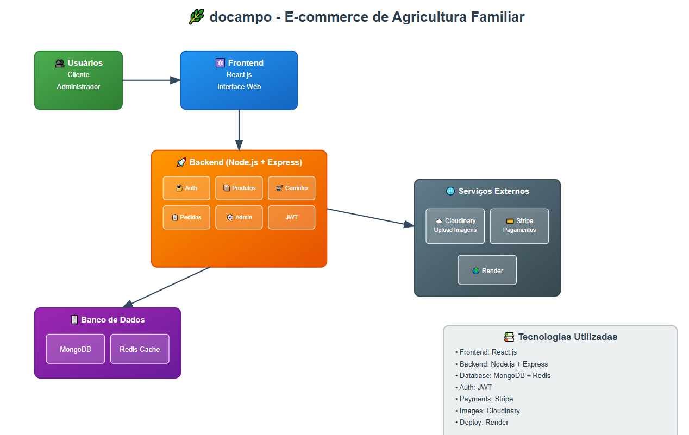

# 🌿 docampo - E-commerce de Agricultura Familiar

## 🛒 Visão Geral

**docampo** é um MVP de e-commerce voltado para produtos da agricultura familiar, com funcionalidades completas para um sistema de vendas online. A aplicação foi desenvolvida com foco em integração entre frontend, backend e banco de dados, seguindo boas práticas de desenvolvimento.

## ⚙️ Tecnologias Utilizadas
Frontend: React.js

Backend: Node.js com Express

Banco de Dados: MongoDB

Autenticação: JWT

Pagamento: Stripe

Upload de Imagens: Cloudinary

Cache e Sessões: Redis


## ✅ Funcionalidades Implementadas

| Módulo     | Funcionalidade                                             | Status |
|------------|------------------------------------------------------------|--------|
| **Auth**   | Cadastro de usuários (email, senha, CPF, endereço)         | ✅     |
|            | Login e autenticação via JWT                               | ✅     |
| **Catálogo** | Listagem de produtos com imagem, nome, preço             | ✅     |
|            | Filtro por categoria                                       | ✅     |
| **Carrinho** | Adicionar/remover produtos do carrinho                   | ✅     |
|            | Cálculo de total                                           | ✅     |
| **Checkout** | Pagamento simulado via Stripe                            | ✅     |
|            | Geração de pedido fake com ID                              | ✅     |
| **Admin**  | CRUD de produtos com autenticação de administrador         | ✅     |
|            | Painel Admin para cadastrar produtos                       | ✅     |
| **UX/UI**  | Feedback visual para ações (ex: item adicionado)           | ✅     |
| **Segurança** | Senhas criptografadas e boas práticas básicas           | ✅     |


## 🧱 Diagrama de Arquitetura




## 🚀 Execução Local

### Variáveis de ambiente - adicione um arquivo .env com suas secrets

```bash
PORT=5000
MONGO_URI=mongo_uri

REDIS_URL=redis_url

ACCESS_TOKEN_SECRET=access_token_secret
REFRESH_TOKEN_SECRET=refresh_token_secret

CLOUDINARY_CLOUD_NAME=cloud_name
CLOUDINARY_API_KEY=api_key
CLOUDINARY_API_SECRET=api_secret

STRIPE_SECRET_KEY=stripe_secret_key
CLIENT_URL=http://localhost:5173
NODE_ENV=development
```

### Para baixar as dependências do projeto
```shell
npm install
```

### Para iniciar o backend

```shell
cd backend
npm run dev
```

### Para iniciar o frontend

```shell
cd frontend
npm run dev
```

## 🚀 Deploy 

Este projeto está hospedado na plataforma [Render](https://render.com).

### Passos para o Deploy
1. Subir o código atualizado no repositório do github.
2. Adicinoar os comandos para o build e start na primeira configuração:
```shell
npm run build 
```
```shell
npm run start 
```
3. Configurar as variáveis de ambiente a partir do arquivo .env.

O projeto pode ser encontrado aqui: [docampo](https://docampo.onrender.com/)
