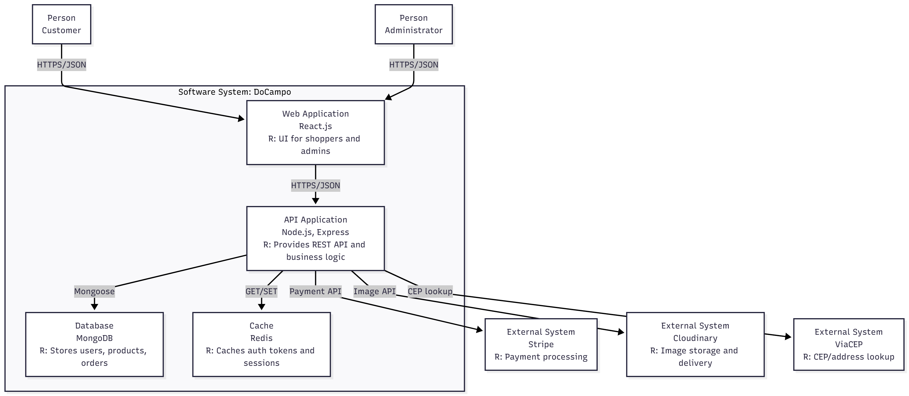
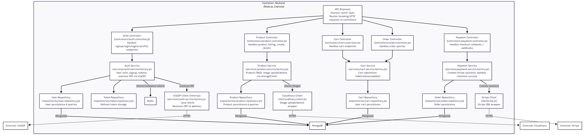

# 🌿 docampo - E-commerce de Agricultura Familiar

## 🛒 Visão Geral

**docampo** é um MVP de e-commerce voltado para produtos da agricultura familiar, com funcionalidades completas para um sistema de vendas online. A aplicação foi desenvolvida com foco em integração entre frontend, backend e banco de dados, seguindo boas práticas de desenvolvimento.

## ⚙️ Tecnologias Utilizadas

Frontend: React.js

Backend: Node.js com Express

Banco de Dados: MongoDB

Autenticação: JWT

Pagamento: Stripe

Upload de Imagens: Cloudinary

Cache de tokens: Redis

## ✅ Funcionalidades Implementadas

| Módulo        | Funcionalidade                                     | Status |
| ------------- | -------------------------------------------------- | ------ |
| **Auth**      | Cadastro de usuários (email, senha, CPF, endereço) | ✅     |
|               | Login e autenticação via JWT                       | ✅     |
| **Catálogo**  | Listagem de produtos com imagem, nome, preço       | ✅     |
|               | Filtro por categoria                               | ✅     |
| **Carrinho**  | Adicionar/remover produtos do carrinho             | ✅     |
|               | Cálculo de total                                   | ✅     |
| **Checkout**  | Pagamento simulado via Stripe                      | ✅     |
|               | Geração de pedido fake com ID                      | ✅     |
| **Admin**     | CRUD de produtos com autenticação de administrador | ✅     |
|               | Painel Admin para cadastrar produtos               | ✅     |
| **UX/UI**     | Feedback visual para ações (ex: item adicionado)   | ✅     |
| **Segurança** | Senhas criptografadas e boas práticas básicas      | ✅     |

## 🧱 Diagrama de Arquitetura

### C2 — Container Diagram



### C3 — Component Diagram (Backend)



## 🏗️ Arquitetura

Projeto organizado em camadas para separação de responsabilidades:

- Routes → Controllers → Services → Repositories → Models (Mongoose).
- `bootstrap.js` instancia services e adapters (Stripe, Cloudinary, Redis) para injeção nas camadas superiores.
- Services orquestram lógica de negócio;
- Repositories encapsulam acesso ao MongoDB.
- Autenticação baseada em JWT com cookies (accessToken/refreshToken) e middleware para proteger rotas.
- Pagamentos via Stripe Checkout.
- Frontend: React + Vite consumindo a API REST do backend.

Essa estrutura facilita o isolamento de dependências e evolução incremental, contribuindo com a manutenabilidade e evolução sustentável da aplicação.

## 🗂️ Ferramenta de Gerenciamento

Utilizei um quadro no Notion para gerenciar o projeto em estilo Kanban. Além do quadro, o espaço do Notion agrega a documentação do projeto: requisitos funcionais e não-funcionais e diagramas arquiteturais.

Você pode acessar o board do projeto aqui: [docampo](https://www.notion.so/Projeto-docampo-19d1eef2e3d241e2b2f67cfc108d1186)

## 🔗 API Endpoints

- Auth

  - POST /api/auth/signup — público — criar usuário
  - POST /api/auth/login — público — login (gera cookies de sessão)
  - POST /api/auth/logout — público (usa cookie) — limpa sessão
  - POST /api/auth/refresh-token — público (usa cookie) — renova token
  - GET /api/auth/profile — protegido — retorna perfil do usuário autenticado

- Products

  - GET /api/products/ — protegido + admin — listar todos (admin)
  - GET /api/products/category/:category — público — listar por categoria
  - POST /api/products/ — protegido + admin — criar produto
  - DELETE /api/products/:id — protegido + admin — remover produto

- Cart

  - GET /api/cart/ — protegido — ver itens do carrinho do usuário
  - POST /api/cart/ — protegido — adicionar item ao carrinho
  - DELETE /api/cart/ — protegido — limpar carrinho
  - PUT /api/cart/:id — protegido — atualizar quantidade do item

- Payments / Checkout

  - POST /api/payments/create-checkout-session — protegido — cria sessão Stripe
  - POST /api/payments/checkout-success — protegido — tratar sucesso do checkout

- Orders
  - GET /api/orders/my — protegido — histórico de pedidos do usuário

Observação: "protegido" significa que a rota exige autenticação (cookie accessToken). Rotas marcadas como admin exigem role `admin`.

## 🚀 Execução Local

### Variáveis de ambiente - adicione um arquivo .env com suas secrets

```bash
PORT=5000
MONGO_URI=mongo_uri

REDIS_URL=redis_url

ACCESS_TOKEN_SECRET=access_token_secret
REFRESH_TOKEN_SECRET=refresh_token_secret

CLOUDINARY_CLOUD_NAME=cloud_name
CLOUDINARY_API_KEY=api_key
CLOUDINARY_API_SECRET=api_secret

STRIPE_SECRET_KEY=stripe_secret_key
CLIENT_URL=http://localhost:5173
NODE_ENV=development
```

### Para baixar as dependências do projeto

```shell
npm install
```

### Para iniciar o backend

```shell
cd backend
npm run dev
```

### Para iniciar o frontend

```shell
cd frontend
npm run dev
```

## 🚀 Deploy

Este projeto está hospedado na plataforma [Render](https://render.com).

O projeto pode ser encontrado aqui: [docampo](https://docampo.onrender.com/)

### Passos para o Deploy

1. Subir o código atualizado no repositório do github.
2. Adicinoar os comandos para o build e start na primeira configuração:

```shell
npm run build
```

```shell
npm run start
```

3. Configurar as variáveis de ambiente a partir do arquivo .env.

## 🆕 Últimas implementações

- Cadastro de endereço com validação de CEP
- Perfil de usuário com histórico de compras

## 🔧 Melhorias / Refatoração

- Refatoração do backend para arquitetura em camadas (routes → controllers → services → repositories) e introdução de `bootstrap.js` para injeção de dependências.

## 🚧 Implementações futuras

- Containerização da aplicação
- Adição de testes unitários cobrindo pelo menos 80% do código
- Possibilidade de visualizar e editar os dados cadastrais no perfil do usuário
- Envio de email após o checkout com dados da compra
